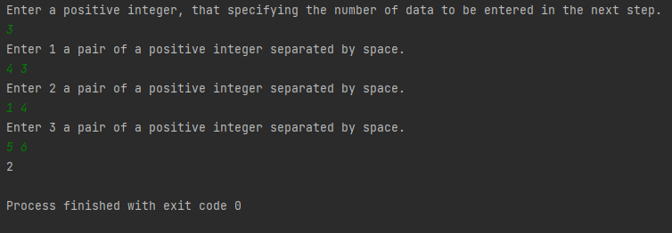

# LSN test tasks
## Building 
1. Download and install [Apache Maven](https://maven.apache.org/)
1. Clone application to yor PC
1. Open command prompt
1. Go to the root directory (~/LSNTestTasks)
1. Execute command **mvn install**
1. Built file with be placed by path: **~LSNTestTasks/target/LSNTestTasks-1.0-shaded.jar**

Built jar file was pushed to directory **bin/LSNTestTasks-1.0-shaded.jar**

## Running
To run built JAR file you should have installed **Java 17+**. Open command prompt and execute command: 

```
java -jar LSNTestTasks-1.0-shaded.jar
```
**LSNTestTasks-1.0-shaded.jar** - Path to jar file. It can be absolute or relative. 

## Interface 
Application implemented as CLI application.
We define which task will be called by enter appropriate number on the first step. 
On the interface we can see short description of the tasks.

After defined the task number you got request for input data depends on selected task. 
Every input data is validated by corresponding validators.

**Task 1** output example. 


**Task 2** output example.


**Task 3** output example.




## Task 1:

### Description:

The input is a long list of integers. Please write a small app that will output the list of distinct elements sorted in
ascending order, plus the basic measurement information that contains the number of elements in the source, number of
distinct elements, min and max value.

Sample:

For the input:

```
1 10 20 20 2 5
```

expected output is:

```
1 2 5 10 20
count: 6
distinct: 5
min: 1
max: 20
```

### Solution

1. Get input as line of integer numbers separated by space.
1. Get array of the numbers from input line by splitting it by space.
1. Сonvert the received array of strings to SortedSet collection with Stream API.
   This action allows to get sorted list with unique elements.
1. Print the received collection to console.
1. Print statistic data.
1. The built JAR file will be located on the path: **~/LSNTestTasks/target/LSNTestTasks-1.0-shaded.jar**

* **distinct** is a size of received collection.
* **count** is the array size from step 2.
* **min** value is the first element
* **max** value is the last element of the collection.

## Task 2

### Description:

Again, the input is a long list of integers. Provide a working code that will find all the pairs (in this integer list)
that sum up to 13. Each pair in the output should have first number not greater than the second one and lines should be
sorted in an ascending order.

Sample:

For the input:

```
1 2 10 7 5 3 6 6 13 0

```

expected output is:

```
0 13
3 10
6 7
6 7
```

### Solution

1. Get sum amount that should be received from an object pairs.
1. Get input as line of integer numbers separated by space.
1. Get array of the numbers from input line by splitting it by space.
1. Tranform the received array of strings to sorted collection of the Integers
1. We take the last element and check the sum starting from the first element.
   If the sum matches the condition, we print the pair. As soon as the sum becomes more than the required one,
   we stop checking and move to the next element from the end and repeat check.

## Task 3

### Description

The first line of input contains a positive number `n`, next `n` lines contains pairs of positive integers, where each
pair identifies a connection between two vertices in a graph. Please provide a working code that will give us the answer
for the following questions: how many separated graphs are in the input.

Sample:

For the input:

```
3
4 3
1 4
5 6
```

expected output is:

```
2
```

### Solution

1. Get Integer number that defined how many of connection between two vertices in a graph will be input on next step.
1. Get list of strings size with [n], we received on first step, of the pairs a pair of a positive integer separated
   by space, that defined connection between two vertices in a graph.
1. Convert List<String> to List<HashSet<Integer>>. Every HashSet in list will have size 2.
1. We take the first number from the first element in the list and check if other elements of the list contain these
   vertices.
   If the element contains the desired vertex, we add it to the first HashSet and remove it from the list.
   In this way check all numbers in the first HashSet in the list.
   When we finished check first one, then go to the next object in the list.
1. The size of the list determines the number of independent graphs.
